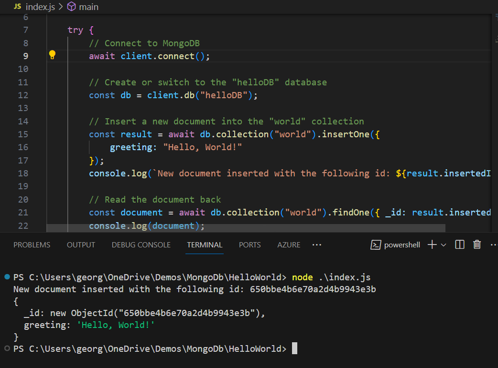

# MongoDB-HelloWorld

This repository contains a simple Node.js application that demonstrates a basic interaction with a MongoDB database.

## Description

The `index.js` file connects to a local MongoDB database named `helloDB`. Once connected, it will insert a "Hello World" document into the `world` collection.

## Prerequisites

1. MongoDB server must be running on your local machine.
2. Node.js and npm must be installed.
3. MongoDB Node.js driver must be installed. You can install it using:
   ```bash
   npm install mongodb
4. Execute:
  ```bash
   node index.js
  ```

## Results


## Notes
- It was easy to install MongoDB and start using immediatly
- It was easy to code using node.js to create documents and retrieve them
- The DocumentDB functionality in DataStax is similar; however, there are more available functions for accessing and manipulating documents in MongoDB 
